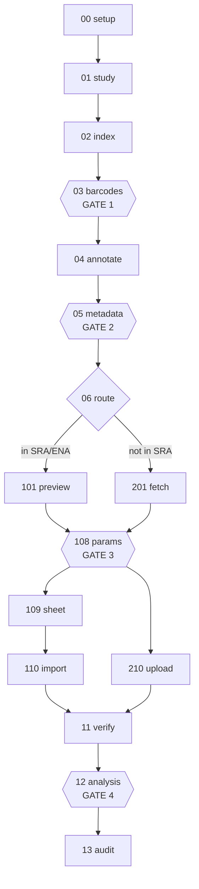

# Flow Compile

Take a published CLIP study from its accession to an analysed project on Flow, with every
field defensible and four points where a person signs off.

**This file is a map, not a rulebook.** Every rule lives in exactly one place, named below.
Earlier revisions restated rules here and drifted: this file once told you to write
`no antibody` for a control while the reference said leave it empty and the validator warned
on the literal string. A reader following this file got it wrong.

## Trigger

Fire when the user wants to:

- upload a published CLIP study (iCLIP, eCLIP, seCLIP, irCLIP, PAR-iCLIP, easyCLIP…) to Flow
- build a Flow annotation sheet from a GEO/ArrayExpress accession
- resolve 5′ barcodes for a CLIP study from its metadata
- import SRA/ENA accessions into a Flow project, or verify an import that already ran
- submit or audit a CLIP-Seq analysis on Flow

Do **not** fire when the user wants to:

- run a non-CLIP assay (RNA-Seq, ChIP-Seq) — those have their own wrappers
- analyse data already on Flow with no upload step — use `flow-bio`
- process FLASH, uvCLAP or PAR-CLIP — detected and refused by name, see
  [`lib/protocol.py`](lib/protocol.py)

## Scope

One task: a CLIP study from accession to analysed Flow project. Barcode resolution, metadata
validation, import and analysis are stages of that one task, not separate skills.

## Workflow

Sixteen numbered stages. Run them in order; each refuses to start before its prerequisites.

```bash
python3 flow_compile.py --status --output <dir>   # what has run, what is waiting
python3 flow_compile.py --next   --output <dir>   # the next command to run
python3 flow_compile.py --run    --output <dir>   # run until something stops
```



Full table of what each stage decides: **[`reference/stages.md`](reference/stages.md)**.

### Exit codes

| code | meaning | what to do |
|---|---|---|
| `0` | ok | continue |
| `2` | usage | fix the arguments |
| `3` | **gate** | review the named artefact, re-run with the release flag |
| `4` | check failed | the data is wrong; fix it |
| `5` | prerequisite not ok | run the stage it names |

`3` and `4` differ on purpose. A gate is not a failure: the run is paused on a person.

### The four hard stops

None can be skipped. A gated stage does not satisfy a prerequisite, so nothing runs past it.

| gate | stage | released by | rules |
|---|---|---|---|
| 1 | `03_barcodes` | `--accept-proposals` | [`reference/barcode-examples.md`](reference/barcode-examples.md) |
| 2 | `05_metadata` | `--accept-metadata` | [`reference/metadata-accuracy-checklist.md`](reference/metadata-accuracy-checklist.md) |
| 3 | `108_params` | `--accept-params` | [`reference/eclip-analysis-params.md`](reference/eclip-analysis-params.md) |
| 4 | `12_analysis` | `--accept-analysis` | [`reference/eclip-analysis-params.md`](reference/eclip-analysis-params.md) |

Confirming a gate is a decision about evidence, not a flag that silences output. Handing back
an unedited proposals file is not approval: each proposal needs `status: confirmed`.

## Where the rules live

Each fact has one home. If this file and a reference disagree, **the reference is right** —
that is what the last drift cost us.

| topic | file |
|---|---|
| What each stage decides, gates, output-dir contract | [`reference/stages.md`](reference/stages.md) |
| Barcode search order and worked examples | [`reference/barcode-examples.md`](reference/barcode-examples.md) |
| Metadata field rules, controls, antibodies, tags | [`reference/metadata-accuracy-checklist.md`](reference/metadata-accuracy-checklist.md) |
| Annotation column meanings | [`reference/annotation-rules.md`](reference/annotation-rules.md) |
| eCLIP header states and analysis parameters | [`reference/eclip-analysis-params.md`](reference/eclip-analysis-params.md) |
| SRA-direct import, sheet columns, size ceiling | [`reference/sra-direct-import.md`](reference/sra-direct-import.md) |
| ENA / ArrayExpress sourced studies | [`reference/ena-arrayexpress-workflow.md`](reference/ena-arrayexpress-workflow.md) |
| Flow API routes and payload shapes | [`reference/flow-api-notes.md`](reference/flow-api-notes.md) |
| Local patches to vendored upstream code | [`lib/vendor/README.md`](lib/vendor/README.md) |
| **Every incident that produced a guardrail** | [`FAILURES.md`](FAILURES.md) |

## Example output

```
$ python3 flow_compile.py --status --output runs/GSE131210
route: direct (easyCLIP) — accessions resolve in SRA/ENA

  [  ok  ] 00_setup       GSE131210
  [  ok  ] 01_study       public, 13 samples
  [  ok  ] 02_index       13 rows
  [  ok  ] 03_barcodes    13 confirmed
  [  ok  ] 04_annotate    13 rows
  [ wait ] 05_metadata    awaiting approval — re-run with --accept-metadata
  [  --  ] 06_route

next: 05_metadata
```

## Gotchas

Deliberately empty. Every rule that used to live here now lives in `reference/`, and every
incident is indexed in [`FAILURES.md`](FAILURES.md) against the test that encodes it. A rule
stated twice is a rule that will drift, and this section is where the drift started.

## Safety

ClawBio is a research and educational tool. It is not a medical device and does not provide
clinical diagnoses. Consult a healthcare professional before making any medical decisions.

Uploading is outward-facing and hard to reverse. Nothing is submitted without the four gates,
and `110_import` and `210_upload` are dry-run unless given `--submit`.

## Agent boundary

The agent dispatches stages, reads their evidence, and explains the result. The stages execute
and decide. When a gate opens, the agent presents the evidence and **the researcher approves**
— never the agent on the researcher's behalf.

## Chaining partners

- **`flow-bio`** — browse and run pipelines on data already in Flow
- **`nfcore-rnaseq-wrapper`** — RNA-Seq deposits accompanying a CLIP study
- **`pubmed-summariser`** — find candidate CLIP studies to upload

## Maintenance

Review when flowbio changes: the import sheet's reserved columns are read from
`flowbio.cli._accession_sheet.RESERVED_COLUMNS` at test time, so a version bump that moves
them fails CI rather than silently unattaching a study.

Staleness signals: a reference contradicting a stage's behaviour; a `FAILURES.md` anchor with
no test; `lib/vendor/` re-vendored without reapplying [`lib/vendor/README.md`](lib/vendor/README.md).

Deprecate when Flow's own import honours `__annotation` columns and resolves run accessions
without expansion — most of the delivery stages exist to work around those two gaps.
