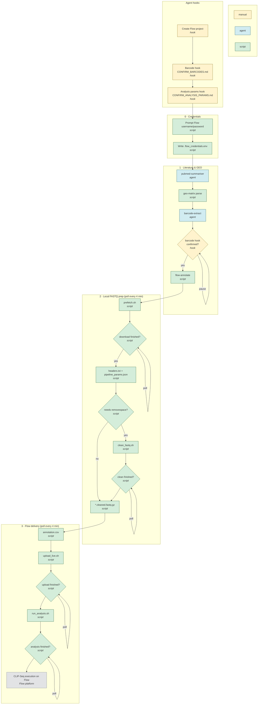

# flow-compile — end-to-end workflow

Paste the diagram below into any Mermaid renderer (GitHub, Notion, mermaid.live, etc.).

**Legend**

| Label | Meaning |
|-------|---------|
| **manual** | Agent hook — pause for user/agent confirmation (barcodes, params, Flow project) |
| **agent** | Agentic — Cursor agent dispatches skills, reads literature/GEO, proposes barcodes |
| **script** | Scripted — deterministic Python (`flow_compile.py` / `lib/*`) or generated shell + 4-min polling |



## Agent vs script boundary

| Phase | Who drives it | What runs |
|-------|---------------|-----------|
| Literature → barcodes | **Agent** | Invokes `flow_compile.py`; dispatches `pubmed-summariser`; reads GEO/paper text for `barcode-extract` proposals |
| Barcode/project/analysis hooks | **Agent + you** | `CONFIRM_BARCODES.md` (with sources), `CONFIRM_ANALYSIS_PARAMS.md`, Flow project ID |
| Compile artifacts | **Script** | `lib/geo_matrix`, `lib/flow_annotate`, `lib/fastq_headers`, `lib/flow_stages` → JSON/XLSX/shell scripts |
| Long-running steps | **Script** | `prefetch.sh`, `clean_fastq.sh`, `upload_live.sh`, `run_analysis.sh`; polled every 4 min by `--run-automated` |

The agent presents hook artifacts and pauses for confirmation. After `--accept-proposals`, long-running execution is scripted, with the analysis-params hook before submission.

## Agent hooks

1. **Barcode hook** — agent presents `CONFIRM_BARCODES.md` (includes evidence **source** and quote); user confirms in `barcode_proposals.json` → `--accept-proposals`
2. **Flow project** — create project in Flow UI; pass `--flow-project-id`
3. **Analysis params hook** — agent presents `CONFIRM_ANALYSIS_PARAMS.md`; after review, copy to `analysis_params.confirmed.json`:

```bash
cp /tmp/gse105082-prefetch/pipeline_params.json \
   /tmp/gse105082-prefetch/analysis_params.confirmed.json
```

## Automated run (credentials first, 4-min polling)

```bash
uv run python skills/flow-compile/flow_compile.py \
  --case gse105082 \
  --output /tmp/gse105082-prefetch \
  --accept-proposals barcode_proposals.json \
  --fastq-dir ~/gse105082/fastq_files/fastq_files \
  --run-automated
```

Steps:
1. **Prompts for Flow credentials** (or uses `FLOWBIO_USERNAME` / `FLOWBIO_PASSWORD` if already set)
2. Compiles annotation + scripts
3. Runs **prefetch** → polls every **4 minutes** until done
4. Runs **clean_fastq.sh** if needed → polls until done
5. Re-compiles with real FASTQs
6. Runs **upload_live.sh** → polls every 4 minutes
7. Verifies **analysis_params.confirmed.json** matches `pipeline_params.json`
8. Runs **run_analysis.sh** → polls every 4 minutes

Logs per step: `OUTPUT/logs/prefetch.log`, `clean.log`, `upload.log`, `analysis.log`

## Visible terminal (recommended)

Long steps run in the background; status prints every 4 minutes. For a **live scrolling log**, open a second terminal:

```bash
tail -f /tmp/gse105082-prefetch/logs/workflow.log   # if using run_workflow.sh
tail -f /tmp/gse105082-prefetch/logs/upload.log       # during upload
```

Or run the generated all-in-one script in its own terminal (uses `tee`):

```bash
bash /tmp/gse105082-prefetch/run_workflow.sh
# WSL/Linux pop-out:
# gnome-terminal -- bash -lc 'tail -f /tmp/gse105082-prefetch/logs/workflow.log'
```

A dedicated terminal tab is useful so agent-driven steps stay visible while you work elsewhere in the IDE. Cursor does not auto-pop a terminal today — `tail -f` on `logs/*.log` is the practical equivalent.

## Output artifacts

| File | Stage |
|------|-------|
| `.flow_credentials.env` | Credential prompt (mode 600, never commit) |
| `run_workflow.sh` | All-in-one script with `tee` for visible logs |
| `CONFIRM_BARCODES.md` | Barcode hook (sources + evidence) |
| `barcode_proposals.json` | Barcode proposals (set `status: confirmed`) |
| `annotation.csv` | Upload sheet (preferred; avoids XLSX font issues) |
| `annotation.xlsx` | Optional XLSX export |
| `pipeline_params.json` | Derived analysis params |
| `CONFIRM_ANALYSIS_PARAMS.md` | Analysis params hook |
| `analysis_params.confirmed.json` | Confirmed analysis params (required by `run_analysis.sh`) |
| `prefetch.sh` / `clean_fastq.sh` / `upload_live.sh` / `run_analysis.sh` | Stage scripts |
| `logs/*.log` | Per-step logs for `tail -f` |
