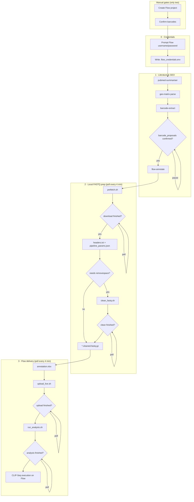

# flow-compile — end-to-end workflow

Paste the diagram below into any Mermaid renderer (GitHub, Notion, mermaid.live, etc.).



## Manual steps (only two)

1. **Barcode confirmation** — edit `barcode_proposals.json`, re-run with `--accept-proposals`
2. **Flow project creation** — create project in Flow UI; pass `--flow-project-id`

## Automated run (credentials first, 4-min polling)

```bash
uv run python skills/flow-compile/flow_compile.py \
  --case gse105082 \
  --output /tmp/gse105082-prefetch \
  --accept-proposals barcode_proposals.json \
  --fastq-dir ~/gse105082/fastq_files/fastq_files \
  --run-automated
```

Steps:
1. **Prompts for Flow credentials** (or uses `FLOWBIO_USERNAME` / `FLOWBIO_PASSWORD` if already set)
2. Compiles annotation + scripts
3. Runs **prefetch** → polls every **4 minutes** until done
4. Runs **clean_fastq.sh** if needed → polls until done
5. Re-compiles with real FASTQs
6. Runs **upload_live.sh** → polls every 4 minutes
7. Runs **run_analysis.sh** → polls every 4 minutes

Logs per step: `OUTPUT/logs/prefetch.log`, `clean.log`, `upload.log`, `analysis.log`

## Visible terminal (recommended)

Long steps run in the background; status prints every 4 minutes. For a **live scrolling log**, open a second terminal:

```bash
tail -f /tmp/gse105082-prefetch/logs/workflow.log   # if using run_workflow.sh
tail -f /tmp/gse105082-prefetch/logs/upload.log       # during upload
```

Or run the generated all-in-one script in its own terminal (uses `tee`):

```bash
bash /tmp/gse105082-prefetch/run_workflow.sh
# WSL/Linux pop-out:
# gnome-terminal -- bash -lc 'tail -f /tmp/gse105082-prefetch/logs/workflow.log'
```

A dedicated terminal tab is useful so agent-driven steps stay visible while you work elsewhere in the IDE. Cursor does not auto-pop a terminal today — `tail -f` on `logs/*.log` is the practical equivalent.

## Output artifacts

| File | Stage |
|------|-------|
| `.flow_credentials.env` | Credential prompt (mode 600, never commit) |
| `run_workflow.sh` | All-in-one script with `tee` for visible logs |
| `barcode_proposals.json` | Barcode extract (human gate) |
| `annotation.xlsx` | Upload sheet |
| `pipeline_params.json` | Analysis params |
| `prefetch.sh` / `clean_fastq.sh` / `upload_live.sh` / `run_analysis.sh` | Stage scripts |
| `logs/*.log` | Per-step logs for `tail -f` |
