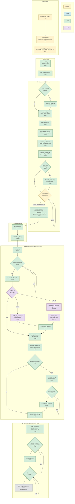

# flow-compile — end-to-end workflow

Operational runbook for `flow_compile.py`. For system design and agent boundaries see **`DESIGN.md`**.
For the ENA / ArrayExpress (SDRF) variant of this workflow see **`reference/ena-arrayexpress-workflow.md`**.

**Bundled demo:** GSE105082 / **GSM2817677** — full matrix in `demo/GSE105082_series_matrix.txt`, single-sample `srr_map` + FASTQ `SRR6181530`. See `DEMO.md`.

---

## Agent playbook (read this first)

This section is the **canonical procedure** for any model running flow-compile. Follow it in order; do not skip gates.

### Session start — collect from the user before any compile

| Input | Required | Notes |
|-------|----------|-------|
| **Flow credentials** | Yes (before upload) | `FLOWBIO_USERNAME` / `FLOWBIO_PASSWORD` or prompt via `credentials.py` |
| **Flow project** | Yes (before upload/analysis) | User creates project in Flow UI; pass `--flow-project-id` or full project URL |
| **GEO accession** (GSE*) or **ArrayExpress** (E-MTAB*) | Yes | Determines matrix/SDRF source |
| **GSM list** or full series | Yes | Which samples to include |
| **SRR/ERR map** | Yes | `srr_map.tsv` from SRA Run Selector or ENA SDRF (`ERS`→`ERR`) |
| **Primary publication** | Strongly recommended | PMID / PMC link for methods |
| **Referenced CLIP methods papers** | When needed | If GEO says “refer to associated publication” or cites an earlier iCLIP/eCLIP protocol paper |

The agent's job at session start is to **gather corpus files**, not to guess barcodes.

### Three mandatory hard stops (never bypass)

| # | Gate | Artifact | Agent action |
|---|------|----------|--------------|
| 1 | **Barcode confirmation** | `CONFIRM_BARCODES.md` + `barcode_proposals.json` | Present every GSM with evidence quotes; pipeline exits **3** until user sets `status: confirmed` and you re-run with `--accept-proposals` |
| 2 | **Flow project ID** | `--flow-project-id` | No `upload_live.sh` / `run_analysis.sh` without it |
| 3 | **Analysis params** | `analysis_params.confirmed.json` | User copies/confirms `pipeline_params.json`; `run_analysis.sh` refuses to run until files match |

**Severity:** Skipping barcode confirmation or inventing barcode strings is a **workflow violation** — treat it like uploading without user approval. If no evidence exists for a GSM, mark `NEEDS_USER_INPUT` and **stop**; ask the user or fetch the referenced publication.

### Barcode discovery — search order and rules

The agent must make a **purposeful effort** to find barcodes in metadata and literature. Search **all** applicable sources; do **not** stop at the first hit; **rank** evidence and present everything in `CONFIRM_BARCODES.md`.

**Recommended search order** (gather all, then rank):

1. **GEO series matrix** (`lib/geo_matrix.py`) — scans every cell for literal `[ACGTN]{4,24}` tokens with at least one `N` → `barcode_hints` per GSM
2. **Per-GSM GEO sample pages** (`geo_sample_fetch.py` / cached `demo/geo_GSM*.txt` / `--fetch-geo`) — `data_processing`, `extract_protocol`, supplementary filenames
3. **Primary paper methods** — agent saves excerpt → `--paper-text` → `barcode_evidence.py` regex
4. **Referenced / prior CLIP protocol papers** — when GEO or sample page cites another PMID (e.g. iCLIP2 PMID 31610236), agent must fetch that methods section too
5. **ArrayExpress SDRF** (ENA path) — `Comment[SUBMITTED_FILE_NAME]` patterns, **not** short `Comment[BARCODE]` tags — see `reference/ena-arrayexpress-workflow.md`
6. **Heuristic fallback only** — `barcode_resolver.py` when **no** text corpus was supplied at all (thin profiles: `flash`, `iclip2`)

**Ranking** (inside `merge_proposal_from_evidence`): `geo_barcode_trim_bp` > `min_read_barcode_umi` > `barcode_umi_lengths` > `literal_barcode` (paper) > `geo_matrix_literal` > protocol hints.

**Agent must NOT:** invent `NNNNNNNNNN`, guess from adapter names, or copy barcodes from chat memory. Every `5' Barcode Sequence` must trace to a **quote** in `barcode_proposals.json` evidence.

**When evidence is empty:** proposal shows `NEEDS_USER_INPUT`; pipeline still pauses; user must supply methods text or confirm manually.

### End-to-end step list (GEO path)

```
0. Credentials + Flow project ID (user)
1. flow_compile.py --geo-matrix --srr-map --paper-text … --output DIR
   → barcode proposals → HARD STOP #1 (exit 3)
2. User confirms barcodes → re-run with --accept-proposals
   → annotation.csv (flow_annotate + sample_naming + protein_target_annotation + organism)
3. Download: prefetch.sh (SRA) OR wget_fastq.sh (ENA FTP) — verify gzip -t
4. Re-compile with --fastq-dir DIR
   → headers.txt + pipeline_params.json
   → optional branch: umi_extract.sh (FLASH / uvCLAP) OR clean_fastq.sh (removespace)
   → re-compile again so annotation.csv filenames match disk
5. upload_live.sh (needs credentials + project ID)
6. HARD STOP #3: user confirms analysis_params.confirmed.json
7. run_analysis.sh
```

### Protocol branches (after `--fastq-dir` re-compile)

| Protocol | Detection | Pre-upload step | Header clean | Pipeline params |
|----------|-----------|-----------------|--------------|-----------------|
| Generic iCLIP / PAR-CLIP | default | — | `clean_fastq.sh` if headers have `/`, space, `_` | `derive_clip_pipeline_params()` |
| eCLIP / seCLIP | method or series text | — | as above | `:rbc:` in header → `encode_eclip=true`; else `move_umi_to_header=true` |
| **FLASH** | extract_protocol / method | `umi_extract.sh` (umi_tools, PE) | **Skip** (keep umi_tools header spaces) | `derive_flash_post_umi_params()` |
| **uvCLAP** | method | `umi_extract.sh` + optional `merge_pe.sh` | **Skip** | `derive_uvclap_post_umi_params()` |
| **ENA / ArrayExpress** | E-MTAB accession | `wget` from ENA FTP (not prefetch) | as generic | barcodes from SDRF filename; may need **multiple executions** by `umi_header_format` group |

Decision after header inspection:

- **`:rbc:` in read name** → UMI already in header; `move_umi_to_header=false`
- **FLASH / uvCLAP evidence** → run `umi_extract.sh` before upload; do not run removespace on umi_tools output
- **Otherwise** → if headers need normalization, run `clean_fastq.sh`; update `annotation.csv` on re-compile

### Demo for new users

```bash
cd ClawBio
uv run python skills/flow-compile/flow_compile.py \
  --case gse105082 --output /tmp/flow-compile-demo
# Exit 3 → review CONFIRM_BARCODES.md, confirm NNNCGGANNN for GSM2817677
```

Full walkthrough: **`DEMO.md`**.

---

Paste the diagram below into any Mermaid renderer (GitHub, Notion, mermaid.live, etc.).

**Legend**

| Label | Meaning |
|-------|---------|
| **manual** | Agent hook — pause for user/agent confirmation (barcodes, params, Flow project) |
| **agent** | Agentic — Cursor agent dispatches skills, reads literature/GEO, presents evidence |
| **script** | Scripted — deterministic Python (`flow_compile.py` / `lib/*`) or generated shell + 4-min polling |
| **branch** | Protocol-specific optional path (FLASH / uvCLAP UMI pre-extract) |


```mermaid
flowchart TD
    subgraph legend[" "]
        direction LR
        LG1[manual]:::manual
        LG2[agent]:::agent
        LG3[script]:::script
        LG4[branch]:::branch
    end

    subgraph manual_gates["Agent hooks"]
        M0["Create Flow project<br/><i>hook</i>"]:::manual
        M1["Barcode hook<br/>CONFIRM_BARCODES.md<br/><i>hook</i>"]:::manual
        M2["Analysis params hook<br/>CONFIRM_ANALYSIS_PARAMS.md<br/><i>hook</i>"]:::manual
        M0 --> M1 --> M2
    end

    subgraph start["0 · Credentials"]
        M2 --> C0["credentials.py<br/>prompt or env<br/><i>script</i>"]:::script
        C0 --> C1[".flow_credentials.env<br/><i>script</i>"]:::script
    end

    subgraph discover["1 · Literature & GEO index"]
        C1 --> P0{"--scan-pubmed?<br/><i>optional</i>"}:::script
        P0 -->|yes| P1["pubmed_stage.py<br/><i>script</i>"]:::script
        P0 -->|no| G0
        P1 --> G0["geo_matrix.py<br/>parse series matrix<br/><i>script</i>"]:::script
        G0 --> G1["load srr_map.tsv<br/><i>script</i>"]:::script
        G1 --> G2["geo_sample_fetch.py<br/>GEO text for barcodes<br/><i>script</i>"]:::script
        G2 --> B0["barcode_evidence.py<br/>regex on paper + GEO<br/><i>script</i>"]:::script
        B0 --> B1["barcode_extract.py<br/>proposals per GSM<br/><i>script</i>"]:::script
        B1 --> B2{"paper text<br/>missing?<br/><i>script</i>"}:::script
        B2 -->|yes| B3["barcode_resolver.py<br/>heuristic fallback<br/><i>script</i>"]:::script
        B2 -->|no| E
        B3 --> E{"barcode hook<br/>confirmed?<br/><i>hook</i>"}:::manual
        E -->|pause| E
        E -->|yes / --accept-proposals| F
    end

    subgraph annotate["2 · Flow annotation"]
        F["flow_annotate.py<br/>+ sample_naming · organism<br/>+ protein_target_annotation<br/><i>script</i>"]:::script
        F --> F2["annotation.csv<br/><i>script</i>"]:::script
        F2 --> F3["annotation_xlsx.py<br/><i>optional</i>"]:::script
    end

    subgraph local["3 · Local FASTQ prep (poll every 4 min)"]
        F3 --> PF["prefetch.sh<br/><i>script</i>"]:::script
        PF --> PF2{"download finished?<br/><i>script</i>"}:::script
        PF2 -->|poll| PF2
        PF2 -->|yes| RC["re-compile --fastq-dir<br/><i>script</i>"]:::script
        RC --> UMI{"FLASH or<br/>uvCLAP?<br/><i>branch</i>"}:::branch
        UMI -->|FLASH| U1["flash_umi_extract.py<br/>umi_extract.sh<br/><i>branch</i>"]:::branch
        UMI -->|uvCLAP| U2["uvclap_umi_extract.py<br/>umi_extract.sh<br/><i>branch</i>"]:::branch
        UMI -->|other| H0
        U2 --> U3["merge_pe.sh<br/>multi-SRR GSMs<br/><i>branch</i>"]:::branch
        U1 --> RC2["re-compile --fastq-dir<br/><i>script</i>"]:::script
        U3 --> RC2
        RC2 --> H0["fastq_headers.py<br/>headers.txt<br/><i>script</i>"]:::script
        H0 --> PP["pipeline_params.py<br/>pipeline_params.json<br/><i>script</i>"]:::script
        PP --> HC{"needs removespace?<br/><i>script</i>"}:::script
        HC -->|yes| CL["header_clean.py<br/>clean_fastq.sh<br/><i>script</i>"]:::script
        HC -->|no| L
        CL --> CL2{"clean finished?<br/><i>script</i>"}:::script
        CL2 -->|poll| CL2
        CL2 --> RC3["re-compile --fastq-dir<br/><i>script</i>"]:::script
        RC3 --> L["upload-ready FASTQs<br/><i>script</i>"]:::script
    end

    subgraph deliver["4 · Flow delivery (poll every 4 min)"]
        L --> FS["flow_stages.py<br/>upload_live.sh · run_analysis.sh<br/><i>script</i>"]:::script
        FS --> P2{"upload finished?<br/>process_runner.py<br/><i>script</i>"}:::script
        P2 -->|poll| P2
        P2 --> Q["run_analysis.sh<br/><i>script</i>"]:::script
        Q --> Q2{"analysis finished?<br/><i>script</i>"}:::script
        Q2 -->|poll| Q2
        Q2 --> U["CLIP-Seq execution on Flow<br/><i>Flow platform</i>"]:::platform
    end

  classDef manual fill:#fff3cd,stroke:#856404,color:#333
  classDef agent fill:#d1ecf1,stroke:#0c5460,color:#333
  classDef script fill:#d4edda,stroke:#155724,color:#333
  classDef branch fill:#e8daef,stroke:#6c3483,color:#333
  classDef platform fill:#e2e3e5,stroke:#6c757d,color:#333
```

## Agent vs script boundary

| Phase | Who drives it | What runs |
|-------|---------------|-----------|
| Target selection & corpus | **Agent** | Chooses GSE/PMID; attaches `--paper-text`, `--geo-cache-dir`, or live `--fetch-geo` |
| PubMed alert (optional) | **Script** | `lib/pubmed_stage.py` → `flagged_papers.json` (uses `pubmed-summariser` `pubmed_api`) |
| GEO index | **Script** | `lib/geo_matrix.py` + `srr_map.tsv` |
| Barcode proposals | **Script + agent** | `barcode_evidence` → `barcode_extract` → `CONFIRM_BARCODES.md`; agent presents sources/quotes |
| Barcode fallback | **Script** | `barcode_resolver.py` when no paper/GEO text corpus |
| Human gates | **Agent + you** | Barcodes (`barcode_proposals.json`), Flow project ID (`--flow-project-id`), analysis params (`analysis_params.confirmed.json`) |
| Annotation & params | **Script** | `flow_annotate`, `fastq_headers`, `pipeline_params`, optional `header_clean` / UMI branches |
| Long-running steps | **Script** | `workflow_runner.py` + `process_runner.py` poll `prefetch.sh`, `umi_extract.sh`, `clean_fastq.sh`, `upload_live.sh`, `run_analysis.sh` every **4 min** (default) |

The agent must **not invent** 5′ barcode strings — only present evidence from `barcode_evidence.py` or confirmed `barcode_proposals.json`.

## Pipeline stages (compile report order)

| Stage key | `lib/` module(s) | Generated artifact(s) |
|-----------|------------------|------------------------|
| `pubmed_alert` | `pubmed_stage.py` | `flagged_papers.json` |
| `geo_audit` | `geo_matrix.py` | (in-memory GSM index) |
| `barcode_extract` | `barcode_evidence.py`, `barcode_extract.py`, `geo_sample_fetch.py` | `barcode_proposals.json`, `CONFIRM_BARCODES.md` |
| `barcode_resolver` | `barcode_resolver.py` or `--accept-proposals` | resolved 5′ / UMI per GSM |
| `flow_annotate` | `flow_annotate.py`, `sample_naming.py`, `organism.py`, `protein_target_annotation.py` | `annotation.csv` |
| `annotation_xlsx` | `annotation_xlsx.py` | `annotation.xlsx` (optional) |
| `prefetch` | `flow_compile.write_prefetch_script` | `prefetch.sh` |
| `flash_umi_extract` | `flash_umi_extract.py` | `umi_extract.sh` (FLASH only) |
| `uvclap_umi_extract` | `uvclap_umi_extract.py` | `umi_extract.sh` (uvCLAP only) |
| `uvclap_merge_pe` | `uvclap_umi_extract.py` | `merge_pe.sh` (when multiple SRRs per GSM) |
| `fastq_headers` | `fastq_headers.py` | `headers.txt` |
| `pipeline_params` | `pipeline_params.py` | `pipeline_params.json`, `CONFIRM_ANALYSIS_PARAMS.md` |
| `header_clean` | `header_clean.py` | `clean_fastq.sh`, `upload_manifest.json` |
| `flow_upload` | `flow_stages.py` | `upload.sh`, `upload_live.sh` |
| `flow_analysis` | `flow_stages.py` | `run_analysis.sh` |
| credentials | `credentials.py` | `.flow_credentials.env` |
| automated orchestration | `workflow_runner.py`, `process_runner.py` | `run_workflow.sh`, `logs/*.log` |

## `lib/` module reference

| Module | Role |
|--------|------|
| `geo_matrix.py` | Parse GEO series matrix → per-GSM metadata dict |
| `geo_sample_fetch.py` | Fetch or load cached GEO sample page text (`geo_GSM*.txt`) |
| `pubmed_stage.py` | Optional PubMed CLIP alert scan; filter + accession extraction |
| `barcode_evidence.py` | Regex extraction from methods / `data_processing` prose → `BarcodeEvidence` |
| `barcode_extract.py` | Merge evidence per GSM; FLASH/replicate assigners; write confirmation bundle |
| `barcode_resolver.py` | Heuristic 5′ barcode when text corpus is thin |
| `flow_annotate.py` | Build upload rows; infer experimental method, protein, condition |
| `sample_naming.py` | Replicate tokens and naming helpers from GEO titles |
| `organism.py` | Normalize species → `Hs` / `Mm` / `Gg` |
| `protein_target_annotation.py` | Infer tag/fusion strings (e.g. `c3xFLAG-HBH`) for purification target |
| `fastq_headers.py` | Sample read headers; detect UMI already in header (`rbc:`) |
| `pipeline_params.py` | Derive execution JSON; eCLIP `encode_eclip=true` only when `:rbc:` in headers |
| `script_paths.py` | Resolve vendored `lib/vendor/flow_api/*` scripts |
| `header_clean.py` | Wrap `removespace.py` → `clean_fastq.sh` when headers break samtools |
| `flash_umi_extract.py` | **Branch:** `umi_tools` on FLASH PE reads → `*_1.umi.fastq.gz` upload |
| `uvclap_umi_extract.py` | **Branch:** PE UMI extract + optional `merge_pe.sh` for multi-SRR GSMs |
| `flow_stages.py` | Generate `upload.sh` / `upload_live.sh` / `run_analysis.sh` |
| `credentials.py` | Prompt or env → `.flow_credentials.env` (mode 600) |
| `workflow_runner.py` | `--run-automated` re-compile loop + step orchestration |
| `process_runner.py` | Background shell steps with periodic log tail (default 240 s) |
| `annotation_xlsx.py` | Optional XLSX export of `annotation.csv` |

**External (vendored in `lib/vendor/flow_api/`):** `uploadsample_flowbio_v6.py`, `flowrunanalysis_flowbio.py`, `removespace.py` — see `lib/script_paths.py`.

**Post-upload sample updating (vendored in `lib/vendor/flow_api/metadata/`):** `flow_edit_samples.py` (name / 5′ barcode / comments by `sample_id` or accession), `flow_public_samples_push_metadata_v2.py`, `pull_project_metadata.py`, `apply_metadata_proposals.py`, `parse_key_resources_antibodies.py`, `flow_public_samples_pull_v3.py` — see `lib/vendor/flow_api/README.md`.

## Agent hooks

1. **Flow project** — create project in Flow UI; pass `--flow-project-id`
2. **Barcode hook** — agent presents `CONFIRM_BARCODES.md` (evidence **source** + quote); user sets `status: confirmed` in `barcode_proposals.json` → `--accept-proposals`
3. **Analysis params hook** — agent presents `CONFIRM_ANALYSIS_PARAMS.md`; after review:

```bash
cp OUTPUT/pipeline_params.json OUTPUT/analysis_params.confirmed.json
```

`run_analysis.sh` exits until `analysis_params.confirmed.json` matches `pipeline_params.json`.

## Protocol branches (FLASH / uvCLAP)

| Protocol | UMI stage | Header clean | Pipeline params |
|----------|-----------|--------------|-----------------|
| Generic iCLIP / eCLIP / PAR-CLIP | — | `clean_fastq.sh` when headers need it | `derive_clip_pipeline_params()` |
| FLASH | `umi_extract.sh` (read 2 → read 1 header) | **Skipped** (keep umi_tools header spaces) | `derive_flash_post_umi_params()` — `move_umi_to_header=false` |
| uvCLAP | `umi_extract.sh` (PE 5′ + 3′ barcodes) | **Skipped** | `derive_uvclap_post_umi_params()` — Trim Galore clip R1=10 R2=5 |
| uvCLAP (multi-SRR GSM) | + `merge_pe.sh` before upload | **Skipped** | same as uvCLAP |

After UMI extract or clean, **`flow_compile.py` is re-invoked with `--fastq-dir`** so `annotation.csv` filenames and `pipeline_params.json` reflect on-disk FASTQs.

## Automated run (credentials first, 4-min polling)

```bash
uv run python skills/flow-compile/flow_compile.py \
  --case gse105082 \
  --output /tmp/gse105082-prefetch \
  --flow-project-id 997999200849251656 \
  --accept-proposals barcode_proposals.json \
  --fastq-dir ~/gse105082/fastq_files \
  --run-automated
```

`workflow_runner.run_automated_workflow()` steps:

1. **Credentials** — `credentials.ensure_flow_credentials()` (or `FLOWBIO_USERNAME` / `FLOWBIO_PASSWORD`)
2. **Initial compile** — annotation + scripts (pauses with exit 3 if barcodes unconfirmed)
3. **Prefetch** — `prefetch.sh` → poll until done
4. **Re-compile** — `--fastq-dir` → `headers.txt`, `pipeline_params.json`, `clean_fastq.sh` / `umi_extract.sh` as needed
5. **UMI extract** — `umi_extract.sh` when present (FLASH / uvCLAP) → re-compile
6. **Header clean** — `clean_fastq.sh` when present → re-compile
7. **Upload** — `upload_live.sh` → poll; check `successful=` / `failed=` in log
8. **Analysis** — verify confirmed params → `run_analysis.sh` → poll

Logs: `OUTPUT/logs/prefetch.log`, `umi_extract.log`, `clean.log`, `upload.log`, `analysis.log`, `workflow.log`

**Note:** `merge_pe.sh` (uvCLAP multi-SRR) is generated by compile but not yet wired into `run_workflow.sh` / `--run-automated`. Run manually between `umi_extract.sh` and upload when the stage report lists `uvclap_merge_pe`.

## Visible terminal (recommended)

Long steps run in the background; status prints every 4 minutes. For a **live scrolling log**:

```bash
tail -f /tmp/gse105082-prefetch/logs/workflow.log   # run_workflow.sh master log
tail -f /tmp/gse105082-prefetch/logs/upload.log     # during upload
```

Or run the generated all-in-one script (uses `tee`):

```bash
bash /tmp/gse105082-prefetch/run_workflow.sh
```

## Output artifacts

| File | Stage / module |
|------|----------------|
| `.flow_credentials.env` | `credentials.py` |
| `run_workflow.sh` | `workflow_runner.py` |
| `flagged_papers.json` | `pubmed_stage.py` |
| `CONFIRM_BARCODES.md` | `barcode_extract.py` |
| `barcode_proposals.json` | `barcode_extract.py` (`status: confirmed`) |
| `annotation.csv` | `flow_annotate.py` |
| `annotation.xlsx` | `annotation_xlsx.py` |
| `headers.txt` | `fastq_headers.py` |
| `pipeline_params.json` | `pipeline_params.py` |
| `CONFIRM_ANALYSIS_PARAMS.md` | `pipeline_params.py` |
| `analysis_params.confirmed.json` | human gate (required by `run_analysis.sh`) |
| `prefetch.sh` | `flow_compile.write_prefetch_script` |
| `umi_extract.sh` | `flash_umi_extract.py` or `uvclap_umi_extract.py` |
| `merge_pe.sh` | `uvclap_umi_extract.py` (uvCLAP multi-SRR) |
| `clean_fastq.sh` | `header_clean.py` |
| `upload_manifest.json` | `header_clean.py` |
| `upload.sh` / `upload_live.sh` | `flow_stages.py` |
| `run_analysis.sh` | `flow_stages.py` |
| `flow_compile_report.md` / `result.json` | `flow_compile.py` |
| `logs/*.log` | `process_runner.py` / `run_workflow.sh` |

## Key CLI flags

| Flag | Effect |
|------|--------|
| `--geo-matrix` / `--srr-map` | Required inputs (or use `--case` / `--demo` preset) |
| `--paper-text` | Methods excerpt for `barcode_evidence` (repeatable) |
| `--geo-cache-dir` / `--fetch-geo` | Per-GSM GEO text for barcodes |
| `--accept-proposals` | Skip barcode hook with confirmed JSON |
| `--require-confirmation` | Default; use `--no-require-confirmation` only for tests |
| `--fastq-dir` | Enable header inspection, UMI scripts, cleaned filenames |
| `--flow-project-id` | Emit upload + analysis shell scripts |
| `--max-files` | Cap prefetch SRR count (`0` = all) |
| `--run-automated` | Full polled workflow via `workflow_runner.py` |
| `--poll-interval` | Seconds between status checks (default 240) |
