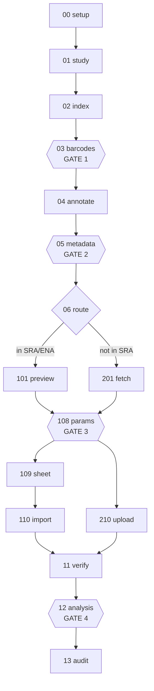

# The stage model

Sixteen numbered scripts. Each decides one thing, records it in `state.json`, and refuses to
run before the stages it depends on. `flow_compile.py` drives them; it knows the order and
nothing else.

```bash
python3 flow_compile.py --status --output <dir>   # what has run, what is waiting
python3 flow_compile.py --next   --output <dir>   # the next command to run
python3 flow_compile.py --run    --output <dir>   # run until something stops
```

## Exit codes

These are the interface. `3` and `4` are different on purpose: the old orchestrator printed a
warning and continued for both "this barcode is awaiting approval" and "this barcode
contradicts the reads", which is how an unapproved barcode could reach an upload.

| code | meaning | what to do |
|---|---|---|
| `0` | ok | continue |
| `2` | usage | fix the arguments |
| `3` | **gate** | review the named artefact, re-run with the release flag |
| `4` | check failed | the data is wrong; fix it |
| `5` | prerequisite not ok | run the stage it names |

## Trunk — every study

| # | stage | decides |
|---|---|---|
| 00 | `00_setup` | run directory, credentials, `state.json` |
| 01 | `01_study` | public? already on Flow? runs expand? does it fit one job? |
| 02 | `02_index` | the samples, and the runs behind them |
| 03 | `03_barcodes` | the 5′ barcode of every sample — **GATE 1** |
| 04 | `04_annotate` | names, target, tag, agent, source, organism, crosslink mate |
| 05 | `05_metadata` | is every field defensible? — **GATE 2** |
| 06 | `06_route` | SRA-direct or local; which protocol — **branch** |

## The branch

One condition. The local line once existed for four reasons: FLASH and uvCLAP read handling, a
UMI in the header comment, and a study absent from SRA. The first two went with those
protocols; the third goes once `removespace` runs inside the clip-seq pipeline.

```
study not in SRA/ENA   ->  local
otherwise              ->  direct
```

So SRA-direct is the path for essentially every study, which is what this skill always claimed
and was not true before.

## Line 1xx — SRA-direct

| # | stage | decides |
|---|---|---|
| 101 | `101_preview` | header state, from the deposited reads |
| 108 | `108_params` | UMI, mate, coherence — **GATE 3**, on both lines |
| 109 | `109_sheet` | build and check the accession sheet |
| 110 | `110_import` | submit and poll |

## Line 2xx — local

Only for a study absent from SRA/ENA.

| # | stage | decides |
|---|---|---|
| 201 | `201_fetch` | reads on disk; header cleaning (transitional) |
| 108 | `108_params` | the same shared gate |
| 210 | `210_upload` | upload with metadata (annotations survive here) |

## Delivery — both lines

| # | stage | decides |
|---|---|---|
| 11 | `11_verify` | did the samples arrive as the sheet described? repair if not |
| 12 | `12_analysis` | submit the analysis — **GATE 4** |
| 13 | `13_audit` | did every sample survive the run? |

## The four hard stops

None can be skipped, and none is a failure. A gate means the run is paused on a person.

| gate | stage | released by | why a person decides |
|---|---|---|---|
| 1 | `03_barcodes` | `--accept-proposals` | a wrong barcode demultiplexes into the wrong sample |
| 2 | `05_metadata` | `--accept-metadata` | a wrong target or agent is wrong in the archive forever |
| 3 | `108_params` | `--accept-params` | a wrong UMI or mate corrupts silently |
| 4 | `12_analysis` | `--accept-analysis` | last point at which a wrong parameter is cheap |

A gated stage does not satisfy a prerequisite, so the next stage cannot run past it. That is
what makes it a stop rather than a message.

## The output directory

Everything lives under `--output`. `state.json` holds decisions, never data: anything
recoverable from a real artefact is read from that artefact, so a damaged `state.json` is
always fixable by deleting it and re-running.

Re-running a completed stage costs nothing. A stage declares its inputs; `state.begin()`
hashes their contents plus that stage's own arguments and reports whether the previous run
still stands. Change an upstream artefact and the downstream stage recomputes on its own.

This replaces the old loop where one command owned both `annotation.csv` and the FASTQ
filenames, so the user had to run it three times for the filenames to catch up. Re-execution
was the dependency mechanism; now the dependency is written down.


