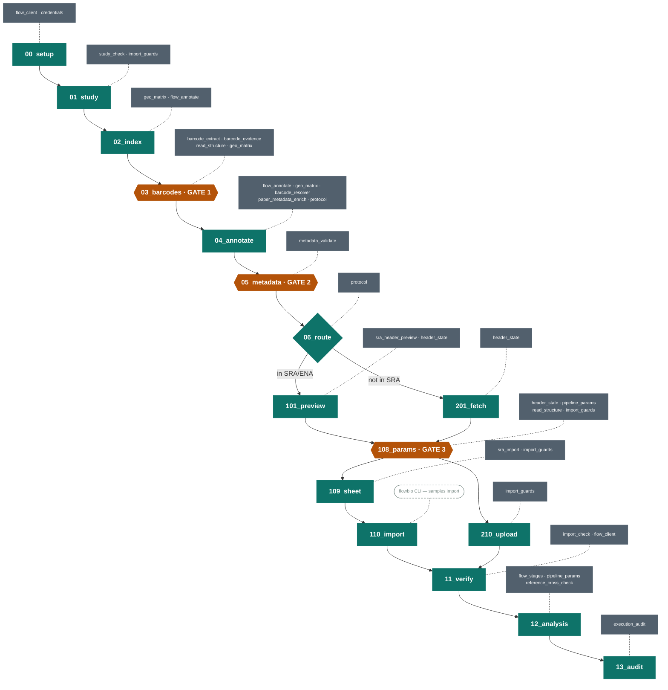

# Wiring — stages, library modules, vendored scripts

The stage pipeline with each stage's library toolkit attached. Solid arrows are the run
order; dotted lines attach the `lib/` modules a stage imports (read from each stage's
`from lib.…` imports — regenerate this diagram from those, not from memory). Hexagons are
the three hard stops.

`110_import` imports no library beyond the stage contract: it shells out to the `flowbio`
CLI. Every stage runs inside `run_stage()` from `stages/_common.py`,
which owns prerequisites, input digests, and the exit codes documented in
`reference/stages.md`.

## The vendored layer, in one line each

Nine scripts under `lib/vendor/` (patches indexed in `lib/vendor/README.md`), reached three ways:

| reached by | scripts |
|---|---|
| imported (the only one) | `parse_key_resources_antibodies.py` — antibody formatting for `metadata_validate` and `paper_metadata_enrich` |
| wrapped by generated runners | `flowrunanalysis_flowbio.py` (runner written by `12_analysis`), `uploadsample_flowbio_v6.py` (via `flow_stages.write_upload_script`) |
| standalone, manual operations | `flow_edit_samples.py`, `flow_public_samples_pull_v3.py`, `flow_public_samples_push_metadata_v2.py`, `pull_project_metadata.py`, `apply_metadata_proposals.py` — `11_verify`'s automated repair goes through `lib/flow_client` instead |

`removespace.py` is vendored but superseded locally: header cleaning runs inside the
clip-seq pipeline on Flow.
